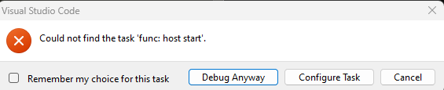
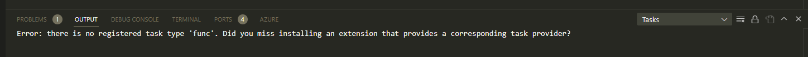

# funcy-containers
Develop Azure Python functions using several workflows:

| Workflow | Python is Installed | Function is Executed | F5/Debug Experience Supported | 
| -------- | ------------------- | -------------------- | ----------------------- |
| VsCode Remote-Containers | Container | Container | Yes |
| Local development (host) - for reference | Host | Host | Yes |

NOTE: The hot-reload workflow was removed but incorporated into the VsCode Remote-Containers workflow. 

# Workflow: VsCode Remote-Containers
The assumption for this workflow is:

1. VsCode runs on the Windows host
2. Docker for Desktop is running on WSL2

The following Visual Studio extensions must be installed first:

1. ms-vscode-remote.remote-containers

To start working in the container, from VsCode: 

1. Press Ctrl+Shift+P to bring up the palette
2. Select Dev Containers: Open Folder In Container...
3. Select the root of this repository.

You are now developing 'in' the container. 

### Check that VsCode recognised the Tasks
If you see this error when you try to F5/Debug:



...or you see this error in the Output tab:



...you will need to Close the Remote Connection (Ctrl+Shift+P; Remote: Close Remote Connection) and then re-open the folder (Ctrl+Shift+P; Dev Containers: Reopen in Container). 

There appears to be a [known bug](https://github.com/microsoft/vscode/issues/165292) whereby tasks.json is parsed by VsCode but before extensions are installed; to prevent that issue occurring, settings.json has been augmented with this setting:

```
    "task.allowAutomaticTasks": "off"
```

### Debugging (F5 experience)
To launch the Azure Function under the Debugger, just press F5. 

Set a breakpoint in __init__.py and then invoke the function:

```
curl http://localhost:7071/api/funcy-python
```

### Hot reload
When source code changes, we want to automatically restart the function. There are complications to doing this when we mount Windows Filesystem into WSL2 (see references below); as a workaround we can use nodemon to 'poll' the file system (--legacy-watch) and restart the function if the source code changes. 

To install nodemon as its dependencies:

```
apt-get update
apt-get install -y npm
npm install -g nodemon
```

To use the hot reload workflow within the container:

```
nodemon -w funcy-python/*py -w funcy-python/function.json --legacy-watch --exec "func host start --verbose"
```

### Python Virtual Environments
Python Virtual Environments are not required for this use case. 


# Workflow: Local development (host)
Tasks have been configured to support interactive debugging on the host. 

### Launching the function
To launch the function manually:

```
func host start --verbose
```

The function is "hot reload" by default on the host: it will automatically reload after changes to the function are saved. 

### Debugging (F5 experience)
To launch the Azure Function under the Debugger, just press F5. 

Set a breakpoint in __init__.py and then invoke the function:

```
curl http://localhost:7071/api/funcy-python
```

### Python Virtual Environments
Python Virtual Environments have been disabled for this project on the host. 

To enable it, in settings.json, add the following line:

```
"azureFunctions.pythonVenv": ".venv"
```

Then execute this command:

```
python -m venv .venv
```

# References
| Reference | Link | 
| -- | -- |
| Add --watch support to func start | https://github.com/Azure/azure-functions-core-tools/issues/1239#issue-437771257 |
| File changes on Windows doe not trigger notifications in Linux apps | https://github.com/microsoft/WSL/issues/4739 |
| Develop 'in' WSL2 - all code is in the WSL2 instance so notifications work | https://code.visualstudio.com/blogs/2019/09/03/wsl2 |
